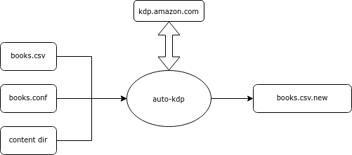

# Objective

Command-line tool to create or update books on Amazon KDP book publishing site. Books are stored in your local CSV file, PDFs to upload are in a local directory.

[KDP](https://kdp.amazon.com) is a wonderful service that allows you to publish print and digital books for free and sell them on Amazon. But if you have a larger number of books, clicking through the website is just mind-numbing. Auto-kdp uses puppeteer under the hood to click thorugh the KDP pages like a human would. 

This software does _not_ bypass any checks in KDP, or solves any problems that KDP itself has. Auto-kdp is just a monkey clicking for you: it can handle a few key pages (create book, upload content, update prices, click publish). 

If you publish few books, you do _not_ need this - but if you publish, say, 100, you absolutely do, unless you want to spend nights on clicking through the KDP site.

### Caveats

- Please note auto-kdp does not handle _everything_ - I created it for my own needs. For example does not currently support subtitle, or kindle books. I wrote it as cleanly as possible so new fields can be added by pattern matching. 
- It may break if amazon changes something in the page, e. g. uses different ```id``` for HTML elements we refer to. There is nothing we can do about it. In My about 2 years of experience this has happened only once.

# How it works



Auto-kdp consumes 

* a list of books in a CSV file (```books.csv```) - one book per row
* key-val defaults file (```books.conf```) 
* path a directory containing all the content (not directly - the content can sit in subdirectories. Each book defined **manuscriptLocalFile** subpath)

The CSV file may look something like this:
| Action                 | title                | authorFirstName | authorLastName | .... |
| ---------------------- | -------------------- | --------------- | -------------- | ---- |
| all                    | Where is my giraffe? | Jane            | Smith          |      |
| all                    | Where is my chicken  | Jane            | Smith          |      |
| pricing:publish:scrape | Where is my froggy?  | Jane            | Smith          |      |

Column names matter, this is how the tool knows what is what (full list in [keys.js](https://github.com/elutek/auto-kdp/blob/main/src/keys.js)). The column **action** tells the tool what to do. 

Run it something like:

```node index.js --books books.csv --config books.conf --content-dir ./content/ [--verbose] [--dry-run] ``` 

Auto-kdp processes books in-order. It executes actions one-by-one until all actions are done, or until failure. If an action fails, it is retried twice. Each action may modify the book data (e. g. action 'scrapeIsbn' fills out the 'isbn' column), and consumes the executed action. After every action, a new CSV file is written out (".new") with current data about all books.

When the tool is done (or, in case it crashes), the ".new" file has the state. You should compare it with the original CSV file, and if all looks good, replace the original books CSV file:

```bash
meld books.csv books.csv.new
mv books.csv.new books.csv
```

# Custom keys

### Defaults

Look again at the table above. Lots of columns will have the same value, for example maybe you are one author publishing many books, or all your books are in the same category. Such columns can be specified in a 'defaults' file, e. g. `books.conf`

```bash
authorFirstName = Jane
authorLastName = Smith
```

If you have a default defined, you can delete the column.

### Variables and resolution

Notice how also ```title``` has a similar structure, just for a different animal? You can create a new column ```animal``` in the CSV file, delete the ```title``` column and configure the default title instead:

```title = Where is my ${animal}?```

Anything in ```${key}```  is resolved by auto-kdp at runtime. It can refer to another key-value (which itself may depend on other variables). The tool will fail if it cannot resolve everything.

It is also possible to put a conditional in a variable
```bash
isGirl = $vareq ${gender} == F
possessivePronoun = $varif ${isGirl} ?? her :: his
```
or refer to a field in another book:
```bash
asinGiraffe = $varbookref ${animal} == Giraffe !! asin
```
The keywords **$vareq**, **$varif** and **$varbookref** have special meaning (this is not any proper language, just a trivial hack to express conditionals and book references).


# Actions

One *action* corresponds to a single activity on a single URL: get the page, read something in the page, and click on some things.

Some actions are "shortcuts" to a list of actions proper. For example  **all** is "book-metadata:content-metadata:scrapeIsbn:produceManuscript:content:pricing:publish:scrape:scrapeAmazonCoverImageUrl".

Individual actions are:

* ```book-metadata``` - update book metadata (first page of book creation). After publishing, only some fields can be updated, such as ```description``` but not ```title```.
* ```content-metadata``` - update content metadata, e.g. glossy vs matte, paper size, etc. This cannot be changed after the book is published.
* ```scrapeIsbn``` - currently we only support getting ISBN from Amazon. When we do that, due to a bug in Amazon, the ISBN is assigned but not shown during creation. This command makes sure we have the ISBN - it may be needed to create a manuscript.
* ```produceManuscript``` - executes a command ```manuscriptCreationCommand```, for example it might be ```cd some/path && make ${animal}.pdf && cd -```. I am writing my books in LaTeX so the manuscript is configurable too. This command will fail if the ```manuscriptLocalFile``` or ```coverLocalFile``` are not found on disk.
* ```content``` - upload cover and manuscript PDFs and get them approved. This cannot be changed after the book is published. If there is an error (KDP shows it during review), e.g. manuscript is wrong size, or there is text in the margins, this action will repeatedly fail, until you resolve the issues with the manuscript.
* ```pricing``` update pricing, set for example in ```priceEur```, ```priceUsd```, etc. This action does not publish, only saves the new prices.
* ```publish``` clicks publish
* ```scrape``` scrapes status (```pubStatus```, ```pubStatusDetail```, ```pubDate```). This ation won't be "consumed" from the ```action``` field until the book is fully LIVE and no updates are pending.
* ```scrapeAmazonCoverImageUrl``` gets you the link to an image with a cover used by Amazon. This is optional, but can be useful when you publish elsewhere a link to your book - this cover will be definitely correct, and is hosted conveniently by amazon, 

Code links: 
* individual actions defined here in [index.js](https://github.com/elutek/auto-kdp/blob/a82f1248e36c145131868abe0c30e764e2368c6a/index.js#L27) 
* shortcuts here in [book.js](https://github.com/elutek/auto-kdp/blob/main/src/book.js#L102). 


# Troubleshooting

Common issues
- if Kdp determines a book has errors during content upload, content upload will continueously fail
- content upload does not work with headless borwser for unknown reason
- cotent upload does not work with browser window that is too small - make it big
- trim sizing is non-trivial: read https://kdp.amazon.com/en_US/help/topic/GVBQ3CMEQW3W2VL6 to figure out. Or upload whatever, and the error displayed on the review page will tell you the expected trim.

# Development

## To add a new custom key

1. First add to keys.js
2. Then add to book.js in the constructor
3. Make all tests pass, which typically update book.js, test-utils.js and some random locations
4. Use the new fields in some actions update desired src/action/...
